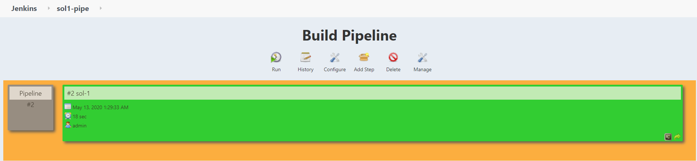

* fork
https://jamesby99@bitbucket.org/jamesby99/base2.git    

* Jenkins결과
    * 성공결과 pipe로 표현
    

* Artifactory결과
  

* cofig.xml 제출

* Java Source수정
  * PersonList.java
  
    ```
    추가코드
    DateFormat format1 = DateFormat.  getDateInstance(DateFormat.FULL);
    System.out.println(format1.format(date));
    ```

* 재실행
    * Jenkins결과
    * 성공결과 pipe로 표현
    

    * Artifactory결과
    

