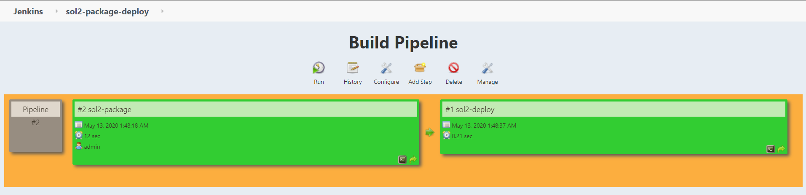
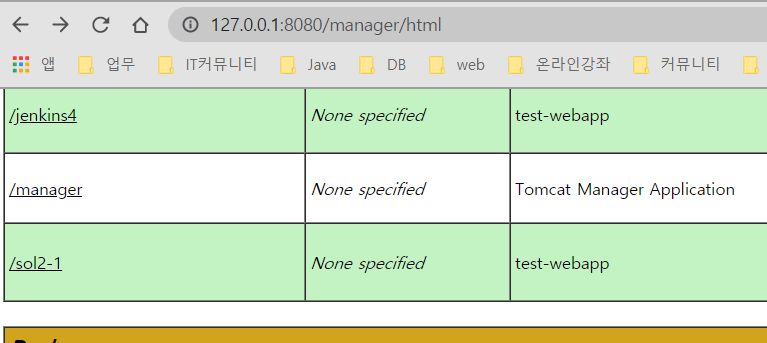
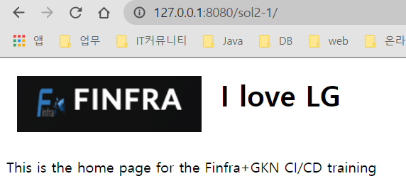
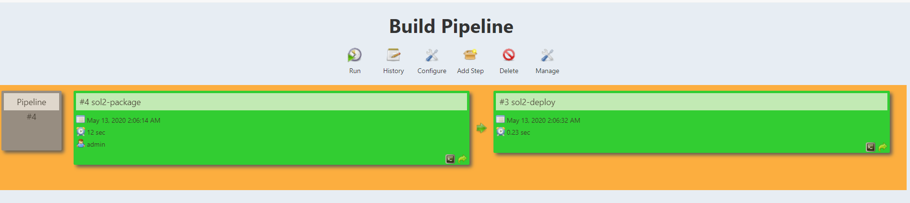
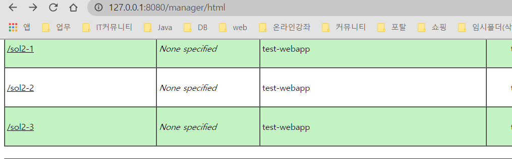
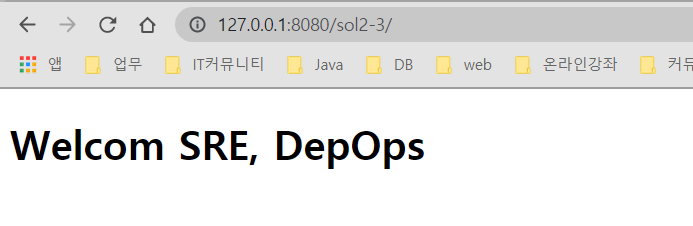

* fork
https://jamesby99@bitbucket.org/jamesby99/webapp.git   

* Jenkins결과
  * pipe로 표현
  

* Tomcat결과
  

* 실행결과
  

* config.xml은 동일파일명으로 rename하여 제출
  * config-mvn-package.xml
  * config-tomcat-deploy.xml
  
* Source수정
  * index.html수정
    ```
    <!DOCTYPE html>
    <html>
      <head>
        <meta charset="utf-8">
        <title>Cloud Dev.</title>
      </head>
      <body>
        <h1>Welcom SRE, DepOps</h1>
      </body>
    </html>
    ```
    * Jenkins결과
        

    * Tomcat결과
        

    * 실행결과
       

